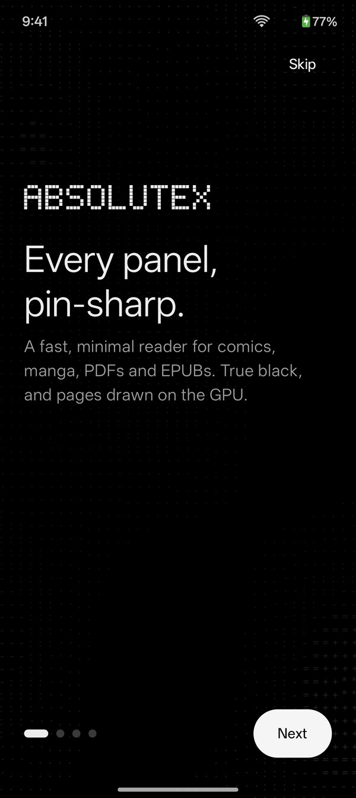
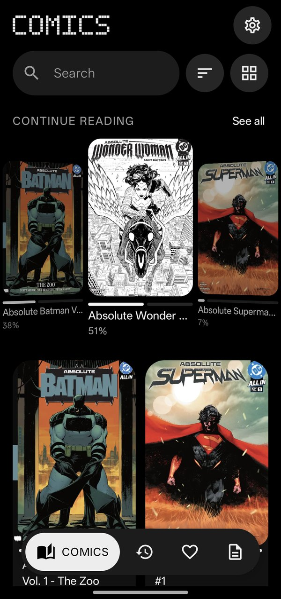
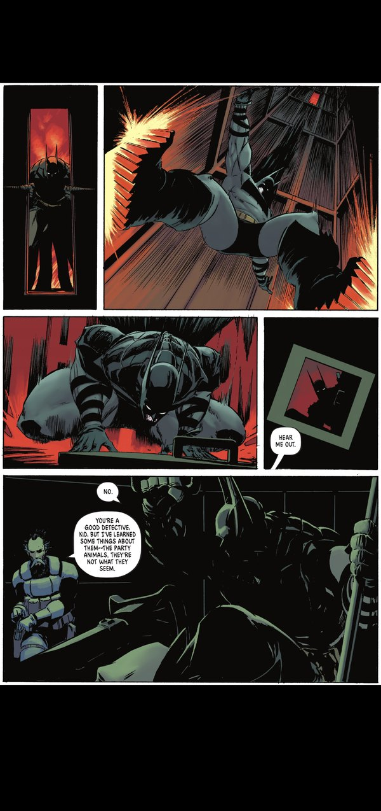
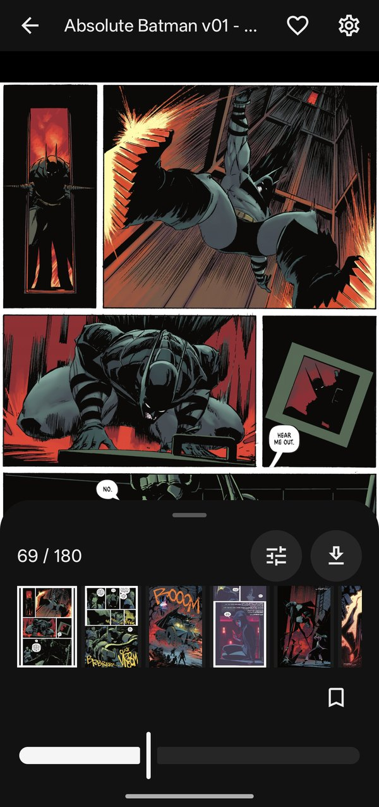
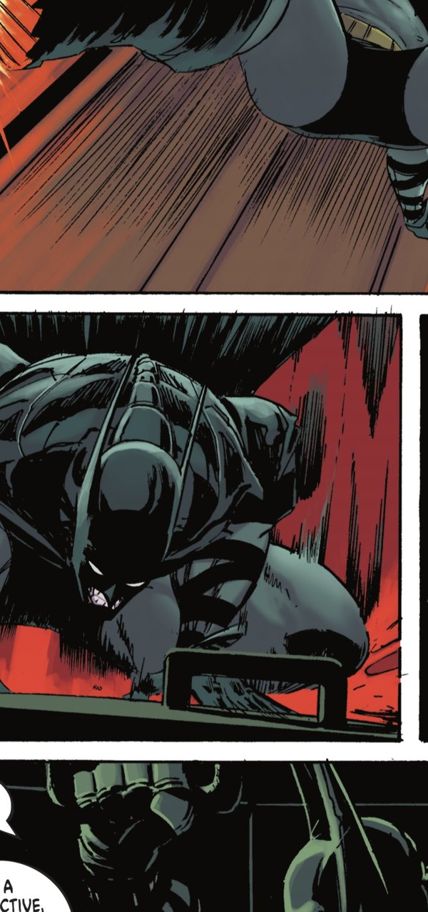
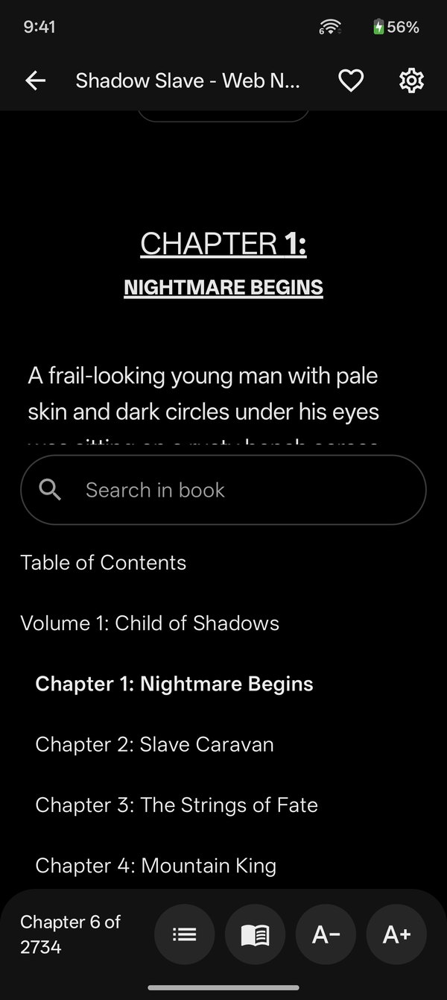
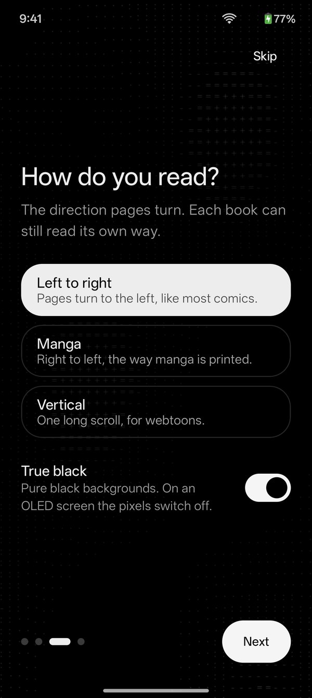
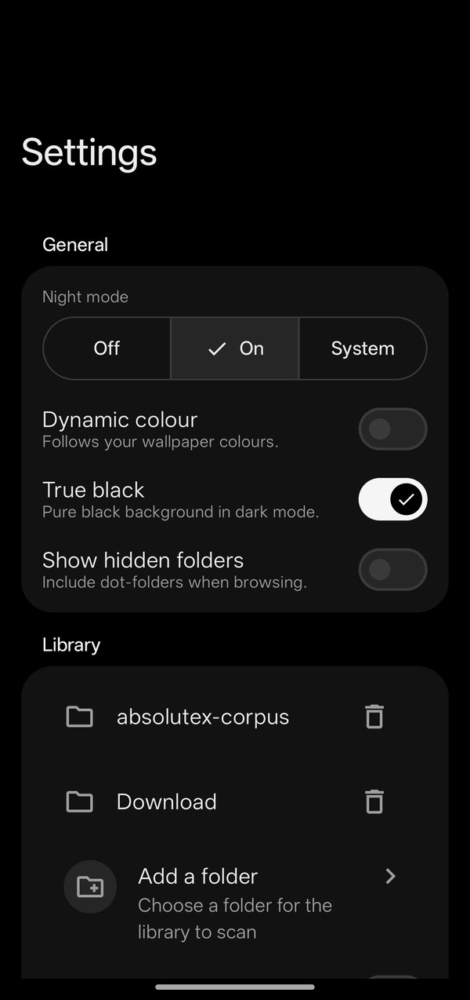

# Absolutex

**A fast, minimal comic and manga reader for flagship Android phones.**

**[Download the latest APK](https://github.com/therahul-yo/Absolutex/releases/latest)** · [Website](https://absolutex.vercel.app/) · [Developer docs](docs/DEVELOPMENT.md)

  
  
  
  

  
  
  
  

Open your comics, manga, PDFs and EPUBs straight from your phone or a network share, and read
them on a true-black, distraction-free screen that keeps up with a 120 Hz display. Pages are
rendered in tiles on the GPU, so zooming into a 6-megapixel scan stays sharp and smooth.

## Features

**Reads what you have**
- Comic archives: CBZ, CBR (including RAR5), CB7 and CBT
- PDF, including password-protected files
- EPUB: fixed-layout comic EPUBs as pages, novels and web novels as reflowable text
- Opens from any folder you pick, from the file manager, or from SMB and FTP/FTPS shares

**Reading comics and PDFs**
- Left-to-right, right-to-left (manga) and vertical reading, chosen per book
- Single page, two-page spreads in landscape, and a continuous vertical strip (the default for PDFs)
- In the strip, pinch zooms the whole column and a finger pans across it, like a document reader
- Smooth pinch and double-tap zoom, tap zones mirrored for right-to-left books
- A seek slider with haptic ticks, a thumbnail strip, bookmarks and a table of contents
- Dark pages for documents, rotation lock, keep-screen-on, volume-key, keyboard and gamepad turning
- Finishing a book offers the next one in the series; save any page as an image

**Picture quality, on the GPU**
- Colour correction: brightness, contrast, saturation, vibrance, warmth and gamma
- Smart border crop that trims scan margins before the first frame
- Mitchell and Lanczos upscaling for sharp text when zoomed
- A background that matches each page's own edge colour

**Reading novels**
- Pages that turn like a book, or one continuous scroll per chapter, with adjustable text size
- The book's own contents list, and search across every chapter with the match highlighted
- Links inside the book work, and your place is saved and restored

**Library**
- Comics, Recent, Favourites and Documents, switched from a floating bar
- A Continue reading wheel that spins and clicks into place; long-press to take a book off it
- Real cover art, series stacks and "new" badges; dense grids become a wall of covers
- Reading stats: pages read, time spent reading and your daily streak
- Search across the whole library, sort by name, date or size, grid or list
- Stays in sync with your folders as files are added or removed

**Design**
- Minimal Material 3 in true black, pixel-block titles, fast non-bouncy motion and haptics
- A one-time setup on first launch: folders, reading direction and a few privacy choices
- Resumes the last book you were reading when the app opens

## Install

Download the APK from the [latest release](https://github.com/therahul-yo/Absolutex/releases/latest)
and open it on your phone (allow installs from your browser or file manager when Android asks).
Updates install over it with your library and reading positions kept.

**Requirements:** Android 13 or newer on a 64-bit flagship-class phone (Snapdragon 8 Gen 1-class
or better). Developed and measured on a OnePlus 11R.

Absolutex deliberately does not support low-end devices: no 16-bit colour paths, no small-cache
fallbacks, no single-threaded decode kept around for weak chips. The hardware floor is a feature —
every compromise removed is a code path that cannot rot or drop a frame.

## Privacy

No ads, no analytics, no crash reporting. Nothing leaves your phone unless you add a network share
yourself. Document covers stay hidden unless you turn them on, so private PDFs never show on your
shelf.

## License

Apache-2.0 — see [LICENSE](LICENSE). No dependency is GPL or AGPL; RAR support comes from
libarchive's clean-room readers, never RARLAB's UnRAR. Details are in the
[developer docs](docs/DEVELOPMENT.md#licensing).

## Contributing

Building from source, the module map, measurement rules and how the agent lanes work are all in
[docs/DEVELOPMENT.md](docs/DEVELOPMENT.md).
